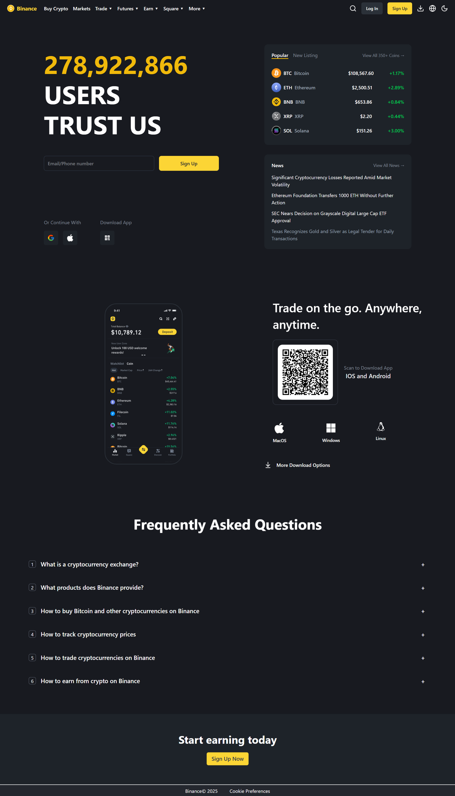

# Binance - Frontend Clone

A responsive frontend clone of the Binance cryptocurrency exchange website, built to replicate its user interface and user experience using modern web technologies.

## 📸 Screenshot



## ✨ Features

- **Responsive Design**: Fully responsive layout that works on desktop, tablet, and mobile devices.
- **Market Data**: Displays mock cryptocurrency market data.
- **Trading Interface**: A replica of the Binance trading view.
- **Component-Based**: Built with reusable React components.


## 🛠️ Tech Stack

- **React**: A JavaScript library for building user interfaces.
- **Tailwind CSS**: A utility-first CSS framework for rapid UI development.
- **Vite**: A next-generation frontend tooling for a faster and leaner development experience.

## 🚀 Getting Started

To get a local copy up and running, please follow these simple steps.

### Prerequisites

Make sure you have Node.js (v16 or newer) and npm or yarn installed on your machine.

### Installation & Setup

1.  **Clone the repository:**
    ```bash
    git clone https://github.com/Bhupendra-Maurya/Binance.git
    ```

2.  **Navigate to the project directory:**
    ```bash
    cd Binance
    ```

3.  **Install dependencies:**
    ```bash
    npm install
    # or
    yarn install
    ```

4.  **Start the development server:**
    ```bash
    npm run dev
    # or
    yarn dev
    ```

The application will be available at `http://localhost:5173`.
